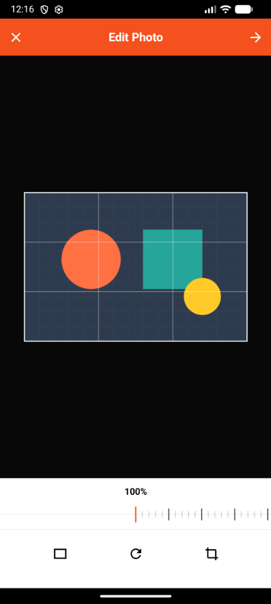

# icorp: Compose Multiplatform Image Cropper

**icorp** is a modern, premium, and fully platform-agnostic image cropping library built using Kotlin Multiplatform and Jetpack Compose Multiplatform. It targets **Android**, **iOS**, and **Desktop (JVM)** with 100% shared UI and business logic.

<p align="center">
  
</p>

---

## ✨ Features

- **Stretchable & Resizable Selection:** Drag corners or borders to freely resize the crop frame. Drag the center to reposition the box.
- **Image Panning & Zooming:** Drag outside the crop box to pan the image. Use the horizontal tick-dial slider at the bottom to zoom the image (100% to 300%).
- **Locked Boundaries:** Constraints guarantee that the crop frame never goes out of the image bounds (prevents black borders).
- **90° Rotation:** Rotate the target image clockwise with automatic bounds recalculation.
- **Aspect Ratio Locking:** Choose between **Free**, **1:1 (Square)**, **4:3**, and **16:9** aspect ratios.
- **Automatic Size Limit (< 1 MB):** Any cropped image is automatically scaled down (maximum dimension of 1500px) if needed, guaranteeing a file size under 1 MB while preserving details.

---

## 🛠️ Step-by-Step Integration

### Option A: Local Maven Dependency (Recommended)
This option compiles and installs the library into your local Maven cache, allowing any Compose Multiplatform project on your computer to import it.

1. **Publish the Library:**
   In your terminal, navigate to the `icorp` library project directory and run:
   ```bash
   ./gradlew :library:publishToMavenLocal
   ```
2. **Enable Local Maven in Target Project:**
   In your target project's root `settings.gradle.kts` (or `build.gradle.kts`), make sure `mavenLocal()` is in the repository list:
   ```kotlin
   dependencyResolutionManagement {
       repositories {
           google()
           mavenCentral()
           mavenLocal() // Add this line
       }
   }
   ```
3. **Add the Dependency:**
   In your target project's shared/common module `build.gradle.kts` (e.g., `composeApp/build.gradle.kts`), declare the dependency:
   ```kotlin
   kotlin {
       sourceSets {
           commonMain.dependencies {
               implementation("icorp:library:1.0.0")
           }
       }
   }
   ```

---

### Option B: Direct Project Module Reference
1. **Copy the `:library` Module:**
   Copy the `library` folder from the `icorp` directory into your target project directory.

2. **Include `:library` in settings.gradle.kts:**
   Open your target project's `settings.gradle.kts` and include the module:
   ```kotlin
   include(":library")
   ```

3. **Add Project Dependency:**
   In your target project's shared module `build.gradle.kts`, add the project reference:
   ```kotlin
   dependencies {
       implementation(project(":library"))
   }
   ```

---

## 💻 How to Use the Composable

In your shared common code (`commonMain`), import the library and place the `ImageCropper` composable:

```kotlin
import androidx.compose.runtime.*
import androidx.compose.ui.graphics.ImageBitmap
import icorp.ImageCropper

@Composable
fun EditPhotoScreen() {
    var activeImage by remember { mutableStateOf<ImageBitmap>(/* Load your source ImageBitmap */) }

    ImageCropper(
        image = activeImage,
        onCropSuccess = { croppedBitmap ->
            // 1. The croppedBitmap is returned here
            // 2. It is guaranteed to be under 1 MB in size
            // 3. You can set it as the new active image or upload it
            activeImage = croppedBitmap
        },
        onCancel = {
            // Handle cancel action (e.g., close editor or revert changes)
        }
    )
}
```

---

## 🚀 Platform Specific Setup

### 📱 1. Android Integration
In your Android module's launcher activity, simply set the content to your shared composable:

```kotlin
package myproject.android

import android.os.Bundle
import androidx.activity.ComponentActivity
import androidx.activity.compose.setContent
import myproject.EditPhotoScreen // Your shared composable

class MainActivity : ComponentActivity() {
    override fun onCreate(savedInstanceState: Bundle?) {
        super.onCreate(savedInstanceState)
        setContent {
            EditPhotoScreen()
        }
    }
}
```

### 🍎 2. iOS Integration (SwiftUI)
1. **Export target:** Create an entry point inside your library's `iosMain` directory:
   ```kotlin
   package icorp

   import androidx.compose.ui.window.ComposeUIViewController

   fun MainViewController() = ComposeUIViewController {
       App() // Your shared Composable
   }
   ```
2. **Xcode Build Phase:** In your Xcode project settings, go to **Build Phases**, add a **Run Script** build phase at the top (before compile sources), and run:
   ```bash
   cd "$SRCROOT/.."
   ./gradlew :library:embedAndSignAppleFrameworkForXcode
   ```
3. **SwiftUI Usage:** Load it using `UIViewControllerRepresentable`:
   ```swift
   import SwiftUI
   import library // Your KMP framework name

   struct ComposeView: UIViewControllerRepresentable {
       func makeUIViewController(context: Context) -> UIViewController {
           MainViewControllerKt.MainViewController()
       }
       func updateUIViewController(_ uiViewController: UIViewController, context: Context) {}
   }

   struct ContentView: View {
       var body: some View {
           ComposeView()
               .ignoresSafeArea(.all)
       }
   }
   ```

### 💻 3. Desktop Integration (JVM)
In your desktop app entry point:

```kotlin
import androidx.compose.ui.unit.dp
import androidx.compose.ui.window.Window
import androidx.compose.ui.window.application
import androidx.compose.ui.window.rememberWindowState
import myproject.EditPhotoScreen

fun main() = application {
    val windowState = rememberWindowState(width = 800.dp, height = 750.dp)
    Window(
        onCloseRequest = ::exitApplication,
        title = "Image Editor",
        state = windowState
    ) {
        EditPhotoScreen()
    }
}
```

---

## ⚙️ API Reference

### `ImageCropper` Parameters

| Parameter | Type | Description |
| :--- | :--- | :--- |
| `image` | `ImageBitmap` | The source image to be edited and cropped. |
| `modifier` | `Modifier` | Layout modifier for the overall screen container. |
| `onCropSuccess` | `(ImageBitmap) -> Unit` | Callback triggered when the checkmark (tick) button is clicked. Returns the cropped `ImageBitmap` (auto-scaled under 1 MB). |
| `onCancel` | `() -> Unit` | Callback triggered when the Close ("X") button is clicked. |
